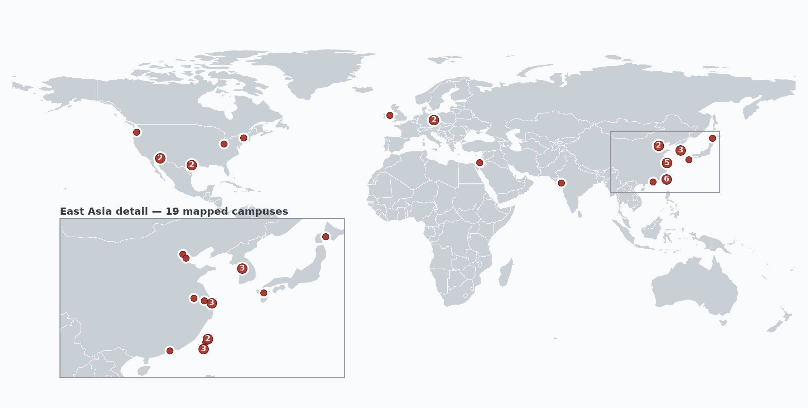

# AI Chip Fab Atlas

**A public-evidence atlas of 31 wafer-fabrication campuses that may matter for
advanced AI chips, compiled by AI agents under human direction as an
experiment in AI-assisted open-source intelligence (OSINT) gathering and
documentation.**

### [Read the Atlas (PDF, 14 MB)](ai-chip-fab-atlas.pdf)

Version 1.0.0 · September 27, 2026 · Evidence reviewed through August 25, 2026.
A full-resolution edition (about 100 MB) is attached to each
[release](../../releases).

GitHub's in-browser PDF viewer does not follow links inside PDFs. Download the
file to use the Atlas's clickable source citations.

## What is in the Atlas

The PDF has an overview map and one page for each of 31 physical
wafer-fabrication campuses in Taiwan, China, the United States, South Korea,
Japan, Germany, Ireland, Israel, and India, operated by TSMC, Samsung, Intel,
GlobalFoundries, SMIC, Hua Hong, Rapidus, and Tata. Each campus page gives:

- the operator, location, and lifecycle status, with an as-of date;
- a cited coordinate and an attributed aerial or satellite image of the campus;
- the campus's documented wafer-fabrication capability;
- any data-center AI accelerators or programs that public sources tie to
  that specific campus; and
- numbered, linked sources for every claim.

Campuses were found by two routes: tracing publicly documented data-center AI
processors to the campuses that plausibly make them, and then reviewing every
publicly identified operating logic campus at 16 nm or more advanced run by the
foundries found in the first step. Eleven older-node or under-construction
sites are included because their capabilities may matter for AI chips.

Keep in mind:

- **The Atlas is not exhaustive.** A campus's absence is not evidence that it
  is irrelevant.
- **"None identified" is a narrow statement.** An accelerator is named on a
  campus page only when public evidence ties it to that particular campus.
  Foundries rarely disclose which fab makes which chip, so "None identified"
  does not mean that no AI chips are made there.
- **Images give geographic context only.** They are not evidence of what a
  campus produces.
- **Claims rest on their cited sources.** Check the underlying sources before
  relying on a claim.

The structured data behind the PDF is in [`data/atlas.json`](data/atlas.json):
32 records (the 31 campuses plus one regional monitoring record),
95 AI-chip products, 93 recorded inclusion and exclusion
decisions, and 270 public sources. The [methodology](docs/METHODOLOGY.md)
explains the inclusion rule and the evidence model.

## An experiment in AI-assisted OSINT

The Atlas was an experiment in how far AI agents can go in gathering and
documenting open-source intelligence about a strategically important industry
when people set the questions and the standards.

**What the AI did.** The Atlas was built over about three weeks in August 2026
with OpenAI's Codex agent (model GPT-5.6-Sol). A main agent session, directed
by a person, handed work to more than 100 helper agents and made on the order
of 1,500 web searches and page reads. The agents:

- found and read public sources, including company filings and announcements,
  government and regulatory records, trade and technical press,
  Chinese-language sources, and open map data;
- traced AI-chip products to foundries, process nodes, and campuses, and
  recorded each claim with its supporting sources;
- compiled a cited coordinate for each campus;
- searched free imagery services for the best available view of each campus
  and recorded each image's provider, terms, and required credit;
- wrote the code that validates the data and generates the maps and the PDF;
  and
- audited their own work.

**What the people did.** Berkeley AI Risk set the scope and the inclusion
rule; set the citation standard (a public source for every claim, and careful
wording about the limits of the evidence); chose the one-page-per-campus format
and the imagery approach; reviewed drafts and pushed back on wording and on
doubtful claims; and made the licensing and release decisions. The people
involved did not re-verify every citation themselves; the systematic checks
described below were carried out by AI agents.

**How it was checked.**

- *Claim separation.* A campus's identity, coordinate, lifecycle, fabrication
  capability, and product links are recorded as separate claims, each with its
  own sources, so evidence for one is not silently used for another. A campus
  being able to make a chip is kept distinct from evidence that it does.
- *Fresh-context audits.* During construction, new agent instances without
  access to the working conversation audited the data record by record. They
  found real errors: citations that did not support the exact claim they were
  attached to, coordinates attributed to sources that did not contain them,
  overstated lifecycle statuses, separate campuses merged into one, and facts
  that had gone out of date.
- *A second system's fact-check before release.* In September 2026 a different
  AI system, Claude Code running Claude Opus 5.5, fact-checked 1,485 claims on
  every campus page and in every product and inclusion record of the August 25,
  2026 snapshot, against the
  cited sources and against other public sources. A second agent then tried to
  refute each flagged problem. The review confirmed 12 false statements,
  including an AI accelerator attributed to the wrong fab and a coordinate that
  fell outside its campus, along with 159 imprecise statements, omissions,
  and citation errors. The corrections were then reviewed the same way, and the issues
  that review found were fixed before release. This release corrects them, apart from a few open items listed in
  the [fact-check record](docs/FACT_CHECK.md); the
  [changelog](CHANGELOG.md) lists every change. Corrected claims still reflect
  evidence available by August 25, 2026.

**What we learned.**

- The agents were good at breadth. They found, read, and structured hundreds of
  sources and recorded their provenance consistently.
- Their characteristic errors were subtle rather than wild: a real source
  cited for a slightly different claim, a confident label on an inferred fact,
  a status that had since changed. Separating claims and auditing with fresh
  agents caught many of these; a second system caught more.
- The judgment calls still came from people: what counts as a single campus,
  how to word the limits of the evidence, which imagery to use, and when a
  surprising claim deserved another look.

## Using and citing the Atlas

Cite the version you used and its evidence cutoff date (see
[`CITATION.cff`](CITATION.cff)):

> Berkeley AI Risk. 2026. *AI Chip Fab Atlas: Public-Evidence Atlas of
> AI-Relevant Chip-Fabrication Campuses*. Version 1.0.0, evidence reviewed
> through August 25, 2026.

For statements about an individual campus, also cite the underlying sources
listed on its page. Corrections and additions are welcome as GitHub issues;
see [`CONTRIBUTING.md`](CONTRIBUTING.md) for what a proposal should include.

## Repository contents

| Path | Contents |
| --- | --- |
| [`ai-chip-fab-atlas.pdf`](ai-chip-fab-atlas.pdf) | The Atlas (compact edition) |
| [`data/atlas.json`](data/atlas.json) | Structured evidence: campuses, products, relationships, inclusion decisions, and sources |
| [`data/imagery-provenance.json`](data/imagery-provenance.json) | Provider, terms, required credit, and hash for each campus image |
| [`data/catalogue-concordance.json`](data/catalogue-concordance.json) | Cross-references to four other open fab catalogues ([notes](docs/CATALOGUE_CONCORDANCE.md)) |
| [`figures/`](figures/) | Locator maps, and a [map comparing fab locations with AI data centers](figures/fab-data-center-comparison.pdf) from Epoch AI |
| [`docs/`](docs/) | [Methodology](docs/METHODOLOGY.md), catalogue concordance, and [fact-check record](docs/FACT_CHECK.md) |
| `src/`, `tests/`, `report/` | Validation, map, and PDF build code and the TeX sources ([build instructions](BUILDING.md)) |
| [`RELATED_PROJECTS.md`](RELATED_PROJECTS.md) | Other fab trackers and registries |

The data can be validated and the maps rebuilt from a public checkout.
Rebuilding the PDF also needs the campus images, which are not distributed
separately from the PDF.

## License

- Code: [MIT License](LICENSE).
- Original text and data: [CC BY 4.0](LICENSE-CC-BY-4.0).
- The aerial and satellite images in the PDF are **not** covered by either
  license; each remains under the terms of the provider credited beside it.
  Coordinates for 16 campuses © OpenStreetMap contributors (ODbL). Epoch AI data
  CC BY 4.0. Natural Earth base maps, public domain.

See [`DATA_AND_IMAGERY_LICENSING.md`](DATA_AND_IMAGERY_LICENSING.md) and
[`THIRD_PARTY_NOTICES.md`](THIRD_PARTY_NOTICES.md).

---

Prepared by [Berkeley AI Risk](https://ai-risk.berkeley.edu).
